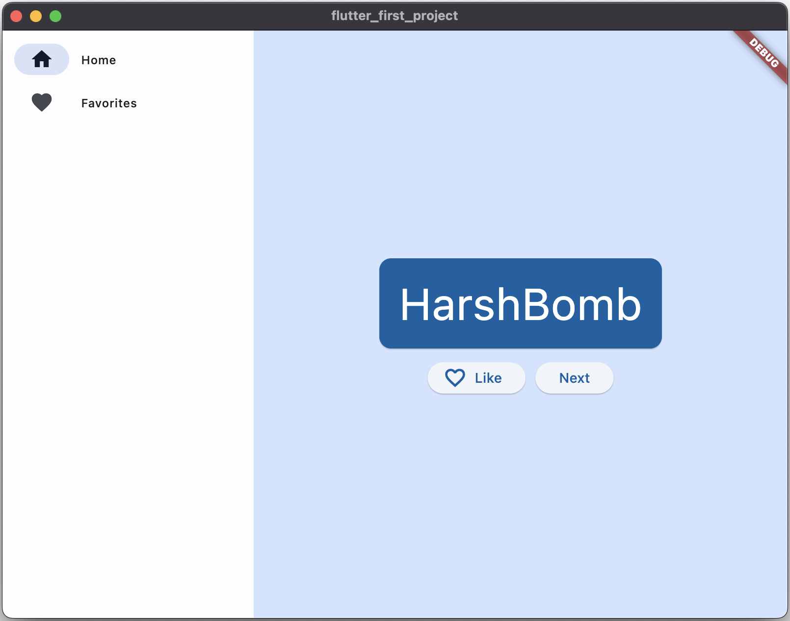
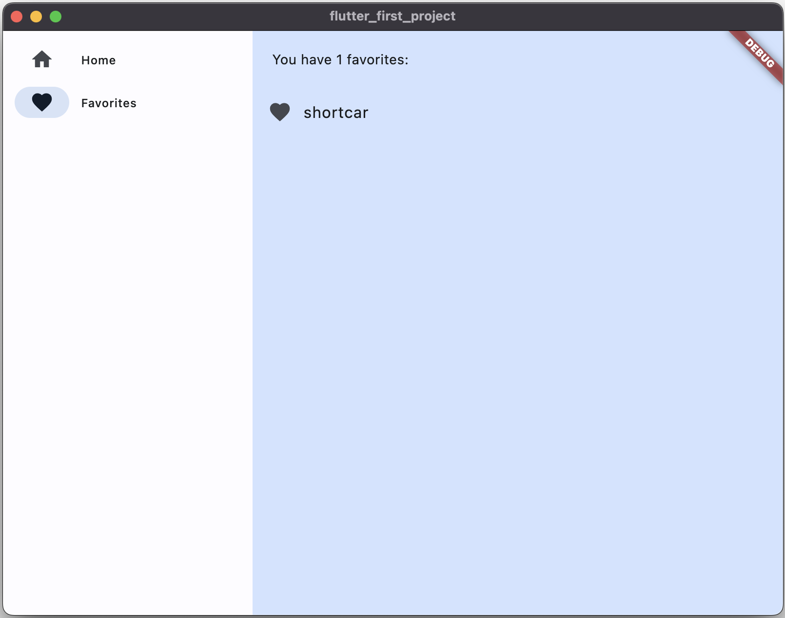

# Flutter_WordPair_Generator

This project is organizally from [codelabs](https://codelabs.developers.google.com/codelabs/flutter-codelab-first#0), which builds a application generating cool-sounding names, such as "newstay", "lightstream", "mainbrake", or "graypine". The user can ask for the next name, favorite the current one, and review the list of favorited names on a separate page. The app is responsive to different screen sizes.

## Installation
### Install Flutter
see [Official Tutorial](https://docs.flutter.dev/get-started/install)

## Screenshots
### The Home Page
   

### Add Favorite
    

### See Favorites
   